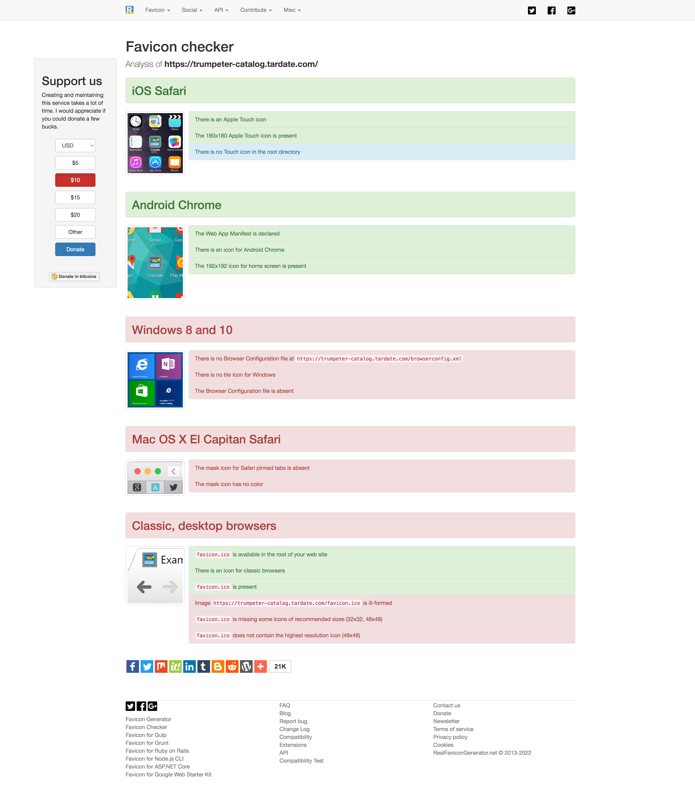

# favicons

All about favicons

## Notes

See the [favicon-cheat-sheet](https://github.com/audreyr/favicon-cheat-sheet)
for a "A painfully obsessive cheat sheet to favicon sizes/types".
See also [Favicon – Why you’re doing it wrong](https://realfavicongenerator.net/blog/favicon-why-youre-doing-it-wrong/)

The absolute fallback is simply a favicon.ico file in the root of your domain.
HTML markup may be used for specific favicon configuration for:

* Touch icon for iOS 2.0+ and Android 2.1+
* IE 10 Metro tile icon
* IE 11 Tile for Windows 8.1 Start Screen
* Largest to smallest apple-touch-icons
* Favicons targeted to any additional png sizes that you add that aren't covered above
* Favicon Chrome for Android

### Online Generators

Online generators seem to come and go. some that I've had success with are:

* <https://favicon.io/favicon-converter/>
* <https://favicomatic.com/>
* <https://www.favicon-generator.org/> - I think tested before
* <http://www.favicon.cc/> - pretty crap, but ok if need basic 16x16 editor

### Validation

Some resources for validating a site's favicon setup

* <https://realfavicongenerator.net/favicon_checker>

Here's an example report from <https://realfavicongenerator.net/favicon_checker> when validating
<https://trumpeter-catalog.tardate.com/>:

## Credits and References

* [favicon-cheat-sheet](https://github.com/audreyr/favicon-cheat-sheet)
* [Favicon – Why you’re doing it wrong](https://realfavicongenerator.net/blog/favicon-why-youre-doing-it-wrong/)
* [Favicon Size Best Practices](https://mailchimp.com/en-gb/resources/favicon-size/) - mailchimp
* [The 2022 Guide to FavIcons for Nearly Everyone and Every Browser](https://www.emergeinteractive.com/insights/detail/the-essentials-of-favicons/)
