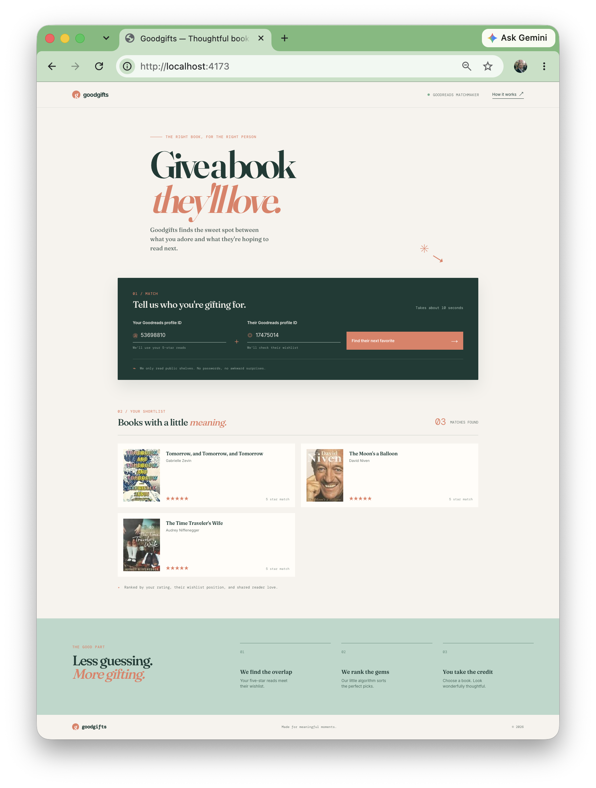

# #478 GoodGifts

Using Copilot CLI to build a simple app to find gift suggestions based on my 5-star reviews and their Goodreads wishlist.

## Notes

I did it again: gifted a book that someone already had.

Crazy thing is we both use [Goodreads](https://www.goodreads.com/)
and I even used it to pick the book from my recent reads, but failed to check if they had already read it.

Goodreads itself has a friend bookshelf comparison feature, but it doesn't (currently) make it easy to pluck out recommendations.

So, time for a little app for that?

### Building with Copilot CLI

I was keen to use this to trial the new [Github Copilot CLI](../../ai/copilot/).
Up to know, my Github Copilot use largely been restricted to simple changes within vscode.

So I went about building the app...and it did a pretty good job!

I used about 10 prompts in total, and my only manual interventions were around the edges:

* tidy and expand the README
* manually fix some text content
* replace the docker control shell script with one based on other work

I am using the free Copilot plan, so this cost me nothing to build except perhaps an hour of two of my time.

How can this remain free and still so functional?? But while it lasts, this seems an excellent Claude-lite experience at no cost!

### The App

See the source at <https://github.com/tardate/goodgifts>, the README has all the information about the app and how to run it.
Or just run the [Docker image](https://hub.docker.com/r/tardate/goodgifts).

Ideally, I would have liked this to be a single-page web app, but CORS restrictions prevent that from being a possibility.

## Credits and References

* <https://www.goodreads.com/>
* <https://github.com/tardate/goodgifts> - source repo
* <https://hub.docker.com/r/tardate/goodgifts> - Docker image
