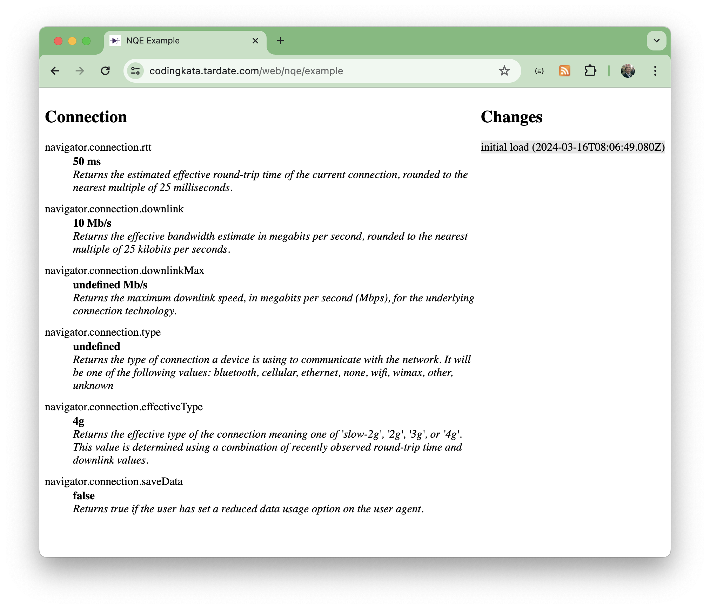

# #284 Network Quality Estimation

Accessing network connection information in the browser.

## Notes

The
[NetworkInformation](https://developer.mozilla.org/en-US/docs/Web/API/NetworkInformation)
object provides details of the network quality according to the browser.

There is an
[interesting discussion](https://groups.google.com/a/chromium.org/g/blink-dev/c/tU_Hqqytx8g/m/HTJebzVHBAAJ)
regarding how this may raise privacy concerns.

### Example

See it in action with the
[example.html](./example.html).

Results will be like this:

In Chrome, may need to enable experimental web platform features in chrome://flags to get downlinkMax and type to display:

## Credits and References

* [Network Quality Estimation in Chrome](https://www.w3.org/2020/02/05-web-networks-Network-Quality-Estimation-in-Chrome.pdf)
* [Network Information API Sample](https://googlechrome.github.io/samples/network-information/)
* [Intent to Ship: Network Information navigator.connection.downlinkMax and onchange event](https://groups.google.com/a/chromium.org/g/blink-dev/c/tU_Hqqytx8g/m/HTJebzVHBAAJ)
* [Navigator: connection property](https://developer.mozilla.org/en-US/docs/Web/API/Navigator/connection)
* [NetworkInformation](https://developer.mozilla.org/en-US/docs/Web/API/NetworkInformation)
